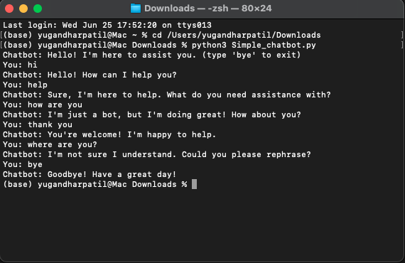

# 🧠 Simple Chatbot (Python CLI)

This is a simple command-line chatbot built with Python. It uses basic pattern matching with regular expressions to understand user input and return predefined responses.

---

## 🚀 Features
- Recognizes simple greetings and questions
- Responds with preset messages
- Handles unknown input with a default response
- Exit anytime by typing `bye`

---

